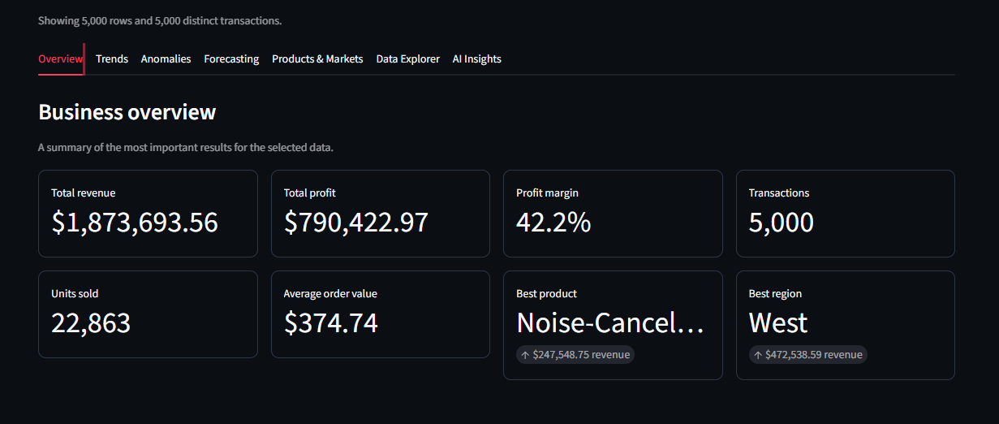
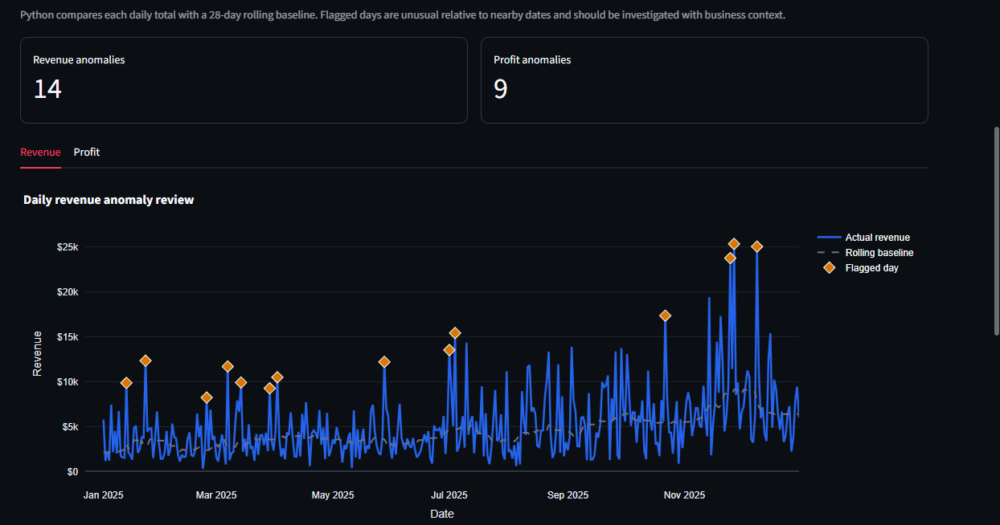
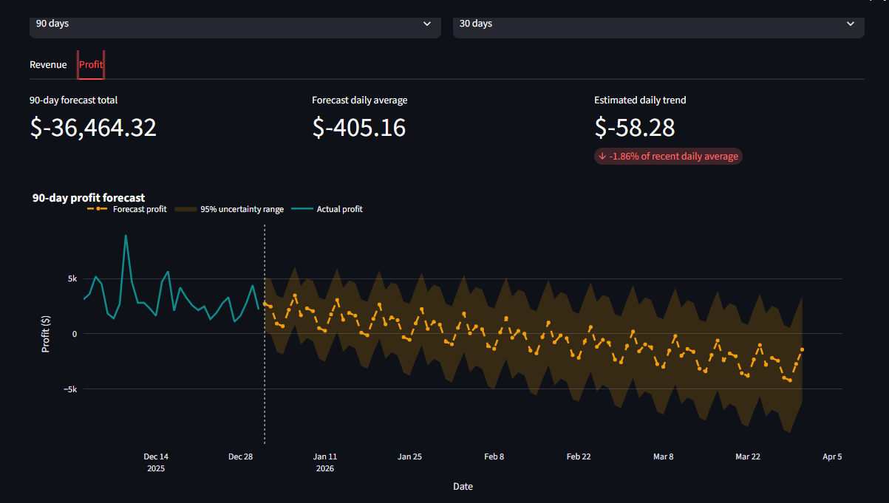
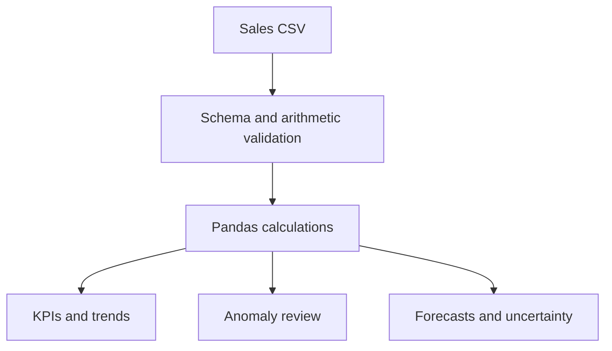

# InsightIQ — AI Business Analytics Assistant

InsightIQ is a portfolio business analytics application that transforms validated fictional sales data into clear KPIs, interactive visualizations, anomaly reviews, and deterministic sales forecasts.

> **Version 2 is live.** The public application runs in analytics-only mode, requires no API key, and makes no paid AI requests.

## Dashboard Preview

### Business overview

### Anomaly review

### Sales forecasting

## What Version 2 Does

- Validates uploaded sales CSVs and financial arithmetic
- Applies date, category, and region filters across the dashboard
- Displays revenue, profit, margin, transaction, unit, order-value, product, and region KPIs
- Provides separate Overview, Trends, Anomalies, Forecasting, Products & Markets, Data Explorer, and AI Insights tabs
- Flags unusual revenue and profit days against a rolling historical baseline
- Forecasts daily revenue and profit using recent linear trends and day-of-week patterns
- Displays a statistical uncertainty range and warns when the forecast horizon exceeds the historical lookback
- Provides accessible chart-equivalent tables and spreadsheet-safe CSV downloads
- Includes a downloadable 5,000-row fictional sample dataset
- Enforces a 10 MB upload limit and a 100,000-row processing limit

## Calculation Approach

Every displayed statistic is calculated by Python. The public app does not ask a language model to calculate, estimate, or invent business metrics.

### Anomaly analysis

Daily totals are compared with a 28-day rolling baseline. Flagged dates are investigation leads, not proof of a business problem.

### Forecasting

Forecasts combine a recent linear trend with observed day-of-week patterns. The uncertainty band communicates statistical variability. Forecasts are estimates, not guarantees or financial advice.

## Engineering Highlights

- Modular analytics, visualization, data-validation, UI, AI, and retrieval layers
- Deterministic financial calculations with application-level validation
- Shared formatting and download-safety helpers
- Spreadsheet-formula protection in exported CSV files
- No arbitrary code execution
- No API credentials stored in Git
- Automated GitHub Actions workflow
- **81 passing automated tests**
- Public deployment from a private source repository
- Versioned rollback points for Version 1 and Version 2

## Optional AI Architecture

The private source repository also contains tested, optional Claude-powered modules for grounded executive summaries, natural-language questions, read-only analytics tools, local document retrieval, and evidence-based recommendations.

These features are disabled in the public deployment because they require paid API access. Python calculates the supporting facts before any optional AI interpretation.

## Technology

| Area | Technology |
|---|---|
| Language | Python 3.12 |
| Interface | Streamlit |
| Data processing | Pandas |
| Visualizations | Plotly |
| Validation | Pydantic and application-level checks |
| Optional AI | Anthropic Python SDK |
| Testing | Pytest |
| Automation | GitHub Actions |
| Deployment | Streamlit Community Cloud |
| Version control | Git and GitHub |

## Fictional Data and Safety

The included sample contains 5,000 entirely fictional transactions covering 12 months. It contains no real customers, confidential company information, or proprietary business data.

The public deployment does not require an Anthropic API key and cannot spend AI API credits. Uploaded files are processed for the active app session; users should still avoid uploading confidential or regulated information to any public demo.

## Source Availability

The application source code is maintained in a private repository to protect potential future commercial use. This public repository contains portfolio documentation and screenshots only.

Source access may be provided for professional review at the author’s discretion.

## Author

Created by [Osayd Jahanzeb](https://github.com/Osaydj).

## Copyright

Copyright © 2026 Osayd Jahanzeb. All rights reserved.

This showcase and the InsightIQ source code are provided for portfolio review only. No license is granted to copy, modify, redistribute, sublicense, or sell the software.
