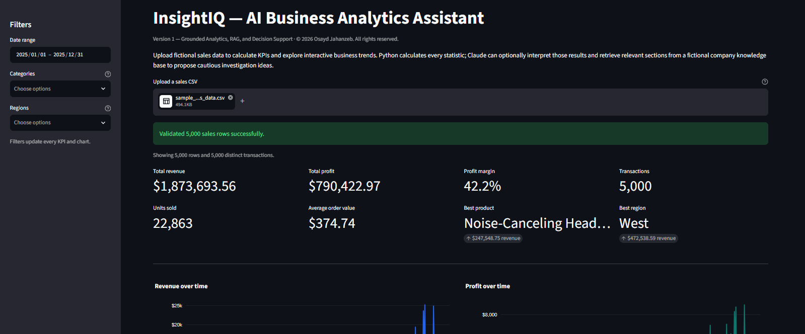
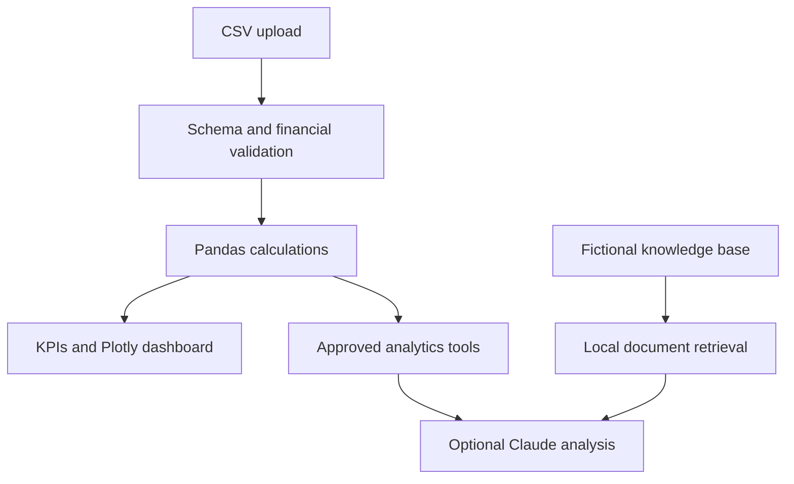

# InsightIQ — AI Business Analytics Assistant

A portfolio business analytics application that transforms validated fictional sales data into business KPIs, interactive dashboards, and grounded decision-support workflows.

## Live Demo

[Launch the InsightIQ analytics dashboard](https://insightiq-business-analytics.streamlit.app)

> The public demo runs in analytics-only mode. It requires no API key and makes no paid AI requests.

## Dashboard Preview

## Project Overview

InsightIQ demonstrates how Python can turn uploaded CSV sales data into reliable business insights. Pandas performs every calculation, while Streamlit and Plotly provide the interactive interface and visualizations.

The application separates deterministic calculations from optional AI interpretation so displayed statistics are never invented by a language model.

## Live Demo Features

- CSV upload and required-column validation
- Date, category, and region filters
- Revenue, profit, and profit-margin KPIs
- Transaction, unit-sales, and average-order-value KPIs
- Best-performing product and region
- Interactive revenue and profit trends
- Category, regional, and product-performance charts
- Accessible supporting tables
- Filtered CSV downloads
- Fictional downloadable sample dataset
- Clear validation and error messages
- 10 MB upload and 100,000-row processing limits

## Optional AI Architecture

The private application source also contains tested, optional Claude-powered modules for:

- Grounded executive summaries
- Natural-language “Ask Your Data” questions
- Approved read-only Pandas analytics tools
- Local retrieval from fictional company documents
- Evidence-based management recommendations
- Conversation history
- Rejection of unsupported statistics and citations

These features are disabled in the public demo because they require paid API access. Python performs the calculations before any optional AI interpretation.

## Architecture

## Engineering Highlights

- Deterministic financial calculations
- Reusable analytics and visualization modules
- Separation of application, data, analytics, AI, RAG, and UI concerns
- Strict CSV schema and arithmetic validation
- No arbitrary code execution
- No API credentials stored in Git
- Private production source repository
- Automated GitHub Actions workflow
- 59 passing automated tests
- Public deployment from a private repository

## Technology

| Area | Technology |
|---|---|
| Language | Python 3.12 |
| Interface | Streamlit |
| Data processing | Pandas |
| Visualizations | Plotly |
| Validation | Pydantic and application-level checks |
| Optional AI | Anthropic Python SDK |
| Testing | Pytest |
| Automation | GitHub Actions |
| Deployment | Streamlit Community Cloud |
| Version control | Git and GitHub |

## Fictional Data and Safety

The included sample contains 5,000 entirely fictional transactions covering 12 months. It contains no real customers, confidential company information, or proprietary business data.

The public deployment does not require an Anthropic API key and cannot spend AI API credits.

## Source Availability

The application source code is maintained in a private repository to protect potential future commercial use. This public repository contains portfolio documentation and screenshots only.

Source access may be provided for professional review at the author’s discretion.

## Author

Created by [Osayd Jahanzeb](https://github.com/Osaydj).

## Copyright

Copyright © 2026 Osayd Jahanzeb. All rights reserved.

This showcase and the InsightIQ source code are provided for portfolio review only. No license is granted to copy, modify, redistribute, sublicense, or sell the software.
